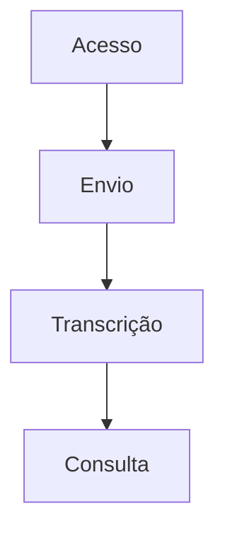

# Exemplo de PRD preenchido

Exemplo de estrutura de ponta a ponta — as 12 seções e o Anexo A — para o
`prd-writer-for-complete-project`. **Títulos e labels em inglês, conteúdo em
português**, que é a Regra de Idioma da FASE 3.

É ilustrativo, não prescritivo: o produto do exemplo (transcrição de reuniões)
serve para mostrar o nível de detalhe, a densidade de cada seção e como os IDs
se encadeiam de uma ponta à outra. O conteúdo vem sempre da entrevista da
FASE 2. Os trechos entre colchetes (`[2-3 parágrafos de resumo...]`) marcam onde
o documento real se estende.

As regras de cada seção estão em `references/prd-sections.md`. Carregue este
arquivo apenas quando precisar ver a forma final montada.

---

# Nome do Produto

## 1. Summary and Context

[2-3 parágrafos de resumo + contexto...]

### Glossary
- **Trecho** — bloco contínuo de transcrição com início e fim marcados

### Assumptions
- **A01** — O público inicial é interno à empresa · *Se estiver errada:* a Seção 3 ganha uma persona externa e a Seção 7 ganha requisitos de acessibilidade pública

## 2. Problem and Motivation

**Revisão manual consome o dia da equipe**
- Cada gravação de 1h leva 3h para ser revisada
- Sentido por: Analista de Conteúdo

**A Motivação**
[...]

**A Oportunidade**
[...]

## 3. Target Audience and Use Scenarios

### Primary Users

**Analista de Conteúdo**
- Revisa 12 gravações por semana
- Precisa localizar trechos específicos sem reassistir
- Hoje depende de anotações manuais

### Behavioral Profile
[...]

### Use Scenarios

#### UC01. Localizar um trecho citado em reunião
- **Persona:** Analista de Conteúdo
- **Gatilho:** Alguém pergunta em que momento um assunto foi tratado
- **Objetivo:** Encontrar e compartilhar o momento exato
- **Percurso:** Abre a gravação → busca o termo → identifica o trecho → salta para o momento → compartilha o link
- **Desfecho de sucesso:** Envia a referência em menos de 2 minutos
- **Frequência / criticidade:** Diária · alta

## 4. Objectives and Success Metrics

**Reduzir o tempo de revisão de conteúdo**

| Métrica | Baseline atual | Meta | Como medir | Quando avaliar |
|---|---|---|---|---|
| Tempo médio de revisão por hora gravada | 3h | 45min | Apontamento de horas da equipe | Mensal, a partir do 2º mês |

## 5. Scope

### In Scope
- **F01 Acesso e Identificação** — cadastro, login e recuperação de conta
- **F02 Envio de Gravação** — envio de arquivos e acompanhamento do progresso

### Out of Scope
**Colaboração**
- Comentários em trechos — adiado para a próxima versão, depende de validar a adoção básica

### Non-Goals
- O produto não pretende ser uma ferramenta de edição de vídeo

## 6. Functional Requirements

### F01. Acesso e Identificação

**Priority:** Must have

**Capabilities:**
- **RF01.1** — O usuário se cadastra com e-mail corporativo e senha de no mínimo 10 caracteres
- **RF01.2** — A sessão permanece ativa por 30 dias no mesmo dispositivo

**Experience:**
[Fluxo em linguagem de negócio...]

**Error Handling:**
- Credenciais incorretas: "E-mail ou senha inválidos" — sem revelar qual dos dois falhou; após 5 tentativas, o acesso é bloqueado por 15 minutos

### F02. Envio de Gravação

**Priority:** Must have

**Capabilities:**
- **RF02.1** — Aceita arquivos de até 2 GB nos formatos MP4, MOV e MP3
- **RF02.2** — Exibe percentual e tempo restante estimado durante o envio

**Experience:**
[...]

## 7. Non-Functional Requirements

| ID | Categoria | Requisito | Alvo mensurável | Como verificar | Prioridade |
|---|---|---|---|---|---|
| RNF01 | Desempenho percebido | A busca dentro de uma transcrição retorna sem espera perceptível | 95% das buscas em até 2s | Amostra mensal sobre uso real | Must have |
| RNF02 | Segurança e privacidade | Cada usuário acessa apenas as gravações da sua equipe | Nenhum acesso cruzado em auditoria trimestral | Auditoria de acessos | Must have |

## 8. Key Decisions and Trade-offs

### D01. A primeira versão atende apenas o público interno
- **Contexto:** Abrir para clientes exigiria adequação de acessibilidade e suporte externo
- **Opções consideradas:** Lançar interno primeiro · Lançar para todos · Beta fechado com clientes
- **Decisão:** Lançar apenas para times internos
- **Motivo:** Permite validar a hipótese central sem carregar o custo de suporte externo
- **Trade-off aceito:** Ganha-se velocidade de validação; abre-se mão de receita e de sinal de mercado real no primeiro ciclo
- **Impacto:** Seção 3 tem apenas personas internas; Seção 7 não exige acessibilidade pública nesta versão
- **Reversibilidade:** Custosa após o lançamento — reabrir exige revisar privacidade e suporte

### Open Questions
| ID | Pergunta em aberto | Impacto se não for respondida | Quem decide | Prazo |
|---|---|---|---|---|
| Q01 | Qual o volume esperado de gravações por mês? | RNF de capacidade fica sem alvo | Operações | Antes do kickoff |

## 9. Dependencies

### External Dependencies
| ID | Dependência | O que entrega ao produto | Impacto se faltar | Responsável | Criticidade |
|---|---|---|---|---|---|
| DEP01 | Serviço de transcrição contratado | Transcrição automática das gravações | O produto perde sua capacidade central | Time de Produto | Bloqueante |

### Organizational Dependencies
| ID | Dependência | O que entrega ao produto | Impacto se faltar | Responsável | Criticidade |
|---|---|---|---|---|---|
| DEP02 | Aprovação do time de Privacidade | Parecer sobre retenção de gravações | O lançamento não pode ocorrer | Jurídico | Bloqueante |

## 10. Risks and Mitigation

| ID | Risco | Categoria | Probabilidade | Impacto | Severidade | Mitigação | Plano de contingência | Responsável |
|---|---|---|---|---|---|---|---|---|
| R01 | A transcrição automática não atinge qualidade aceitável no vocabulário do domínio | Dependência externa | Média | Alto | Alta | Validar com 20 gravações reais antes do lançamento | Permitir correção manual do texto | Time de Produto |

## 11. Acceptance Criteria

### F01. Acesso e Identificação
- [ ] (RF01.1) O cadastro é concluído com e-mail corporativo válido e senha de 10+ caracteres
- [ ] (RF01.1) O cadastro é recusado com mensagem específica quando a senha tem menos de 10 caracteres
- [ ] (RF01.2) O usuário permanece autenticado ao retornar no mesmo dispositivo dentro de 30 dias

### F02. Envio de Gravação
- [ ] (RF02.1) Um arquivo MP4 de 2 GB é enviado com sucesso
- [ ] (RF02.1) Um arquivo de 2,1 GB é recusado com mensagem informando o limite
- [ ] (RF02.2) O progresso exibe percentual e tempo restante durante todo o envio

### Non-Functional Acceptance
- [ ] (RNF01) Em uma amostra de 100 buscas reais, ao menos 95 respondem em até 2s
- [ ] (RNF02) Uma auditoria de acessos não encontra nenhum acesso a gravação de outra equipe

### Cross-Feature Integration
- [ ] (UC01) O analista localiza um trecho por busca e chega ao momento correto da gravação em menos de 2 minutos, partindo da lista de gravações

## 12. Validation and Test Strategy

**Abordagem de Validação**
[...]

**Níveis de Validação**
| Nível | O que valida | Quem executa | Evidência de aprovação |
|---|---|---|---|
| Validação funcional | Cada RF da Seção 6 | Time de qualidade | Checklist da Seção 11 marcado |
| Validação de cenário | UC01 a UC05 | Usuário-chave de cada persona | Cenário concluído sem apoio |

**Massa de Dados e Ambiente de Validação**
[...]

**Critérios de Entrada e Saída**
[...]

**Rollout e Validação Pós-Lançamento**
[...]

**Responsabilidades**
[...]

---

# Appendix A: Implementation Planning

> Este anexo **não faz parte do PRD**. Ele não contém requisitos de produto e não deve ser usado como fonte de escopo de negócio. Existe para registrar o grafo de dependências entre features e o sequenciamento de construção. Decisões de arquitetura e tecnologia permanecem fora daqui — elas pertencem ao HLD e ao FDD.

## A.1 Feature Data Contracts

### F02. Envio de Gravação
**Provides:**
- Identificador da gravação, duração e formato (used by F03)

### F03. Transcrição
**Consumes:**
- F02: identificador da gravação, duração e formato

**Provides:**
- Trechos com marcação de início e fim, idioma detectado (used by F04)

## A.2 Dependency Graph

| # | Feature | Priority | Dependencies |
|---|---------|----------|--------------|
| F01 | Acesso e Identificação | 1 | None |
| F02 | Envio de Gravação | 1 | F01 |
| F03 | Transcrição | 1 | F02 |
| F04 | Consulta e Navegação | 2 | F03 |

## A.3 Foundation Features

### Foundation Features
Estas features configuram a infraestrutura compartilhada do projeto. Em um projeto greenfield, elas devem ser implementadas sequencialmente, antes ou em conjunto com qualquer feature que dependa delas:
- **F01 Acesso e Identificação** — estabelece a base da aplicação e a camada de identificação de usuário

## A.4 Execution Waves

### Execution Waves
As features de uma mesma wave podem ser construídas em paralelo. Uma wave só começa depois que todas as features das waves anteriores estiverem concluídas.

**Nota:** As foundation features (ver acima) não podem ser executadas em paralelo em um projeto greenfield, mesmo que apareçam juntas em uma wave — elas compartilham arquivos de scaffolding e devem ser implementadas sequencialmente até que a base esteja pronta.

- **Wave 1**: F01
- **Wave 2**: F02
- **Wave 3**: F03
- **Wave 4**: F04

## A.5 Priority levels

### Priority levels
- **1** = Must have — o produto não funciona sem ela
- **2** = Should have — agrega valor significativo
- **3** = Could have — melhoria incremental

## A.6 Use Scenario Coverage

### Use Scenario Coverage

| UC | Features | Owner |
|----|----------|-------|
| UC01 | F03, F04 | F04 |
