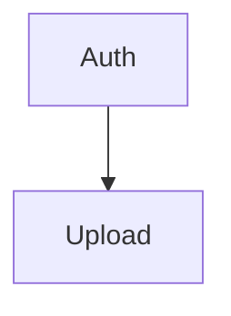

# Conteúdo das 12 seções do PRD e do Anexo A

Fonte canônica do **conteúdo** que a FASE 3 do `prd-writer-for-complete-project`
precisa produzir: o que cada uma das 12 seções do PRD carrega, com formato,
regras e exemplos, mais o Anexo A de planejamento de implementação.

Carregue este arquivo **uma vez, na FASE 3**, quando for redigir o documento. A
FASE 4 valida o resultado contra as regras daqui; a FASE 5 salva.

- A **Fronteira de Negócio** (definida no `SKILL.md`) vale para as Seções 1 a 12.
  O Anexo A é a única exceção, e está explicitamente marcado como fora do PRD.
- O **sistema de identificadores** (`F`, `RF`, `RNF`, `D`, `Q`, `DEP`, `R`, `A`)
  e a **Regra de Ouro** ficam no `SKILL.md`, FASE 3.
- O exemplo completo de um PRD preenchido está em `references/prd-example.md`.
- Os títulos das seções, os labels estruturais e os cabeçalhos de tabela deste
  arquivo são **âncoras**: o `spec-writer`, a `implement-feature` e a
  `implement-and-evaluate-tmux` localizam o conteúdo do PRD por eles. Ficam em
  inglês, literalmente; o conteúdo é escrito em pt-BR.

---

## As 12 seções do PRD

### Section 1: Summary and Context

**Resumo** — 2 a 3 parágrafos cobrindo:
- O que é o produto
- Para quem
- Qual é o valor central
- Como se encaixa na operação/negócio hoje (contexto), não como funciona por dentro

**Contexto** — o cenário em que o produto nasce: o que existe hoje, o que muda, quem é afetado, qual o momento do negócio.

**Glossary** (inclua quando o domínio tiver 3+ termos não óbvios) — termo em negrito e definição em uma linha. Use o vocabulário do usuário, não invente sinônimos.

**Assumptions** — lista das premissas assumidas na redação do documento:
```markdown
- **A01** — <premissa> · *Se estiver errada:* <o que muda no PRD>
```
Omita a subseção apenas se não houver nenhuma premissa (raro).

---

### Section 2: Problem and Motivation

**O Problema** — 3 a 5 categorias de dor:
- Título em negrito
- 3-4 bullets, com impacto quantificado quando o usuário forneceu o número (custo, tempo perdido, volume, taxa de erro). Se não forneceu, descreva o impacto qualitativamente ou marque `[A DEFINIR]` — não estime.
- Diga **quem** sente cada dor, ligando à persona da Seção 3

**A Motivação** — por que resolver isso agora:
- O que muda no negócio se for resolvido
- O custo de não fazer nada
- O que já foi tentado e por que não bastou (quando houver)

**A Oportunidade** — conexão problema → resposta do produto:
- Cada categoria de dor mapeada para a capacidade que a endereça
- Seja específico sobre o diferencial

---

### Section 3: Target Audience and Use Scenarios

**Primary Users** — perfis distintos, derivados da diversidade real de uso:
- Nome do perfil em negrito
- 3-4 bullets: contexto de trabalho, necessidade central, o que hoje o impede, frequência de uso
- Gere quantas personas o produto genuinamente exigir — NÃO force um número fixo. Público homogêneo: 1-2 basta. Grupos com jornadas distintas: mais.

**Behavioral Profile** — características comuns a todas as personas (nível de familiaridade digital, dispositivo, ambiente, tolerância a fricção).
- Omita quando houver apenas 1 persona — os bullets dela já cobrem isso.

**Use Scenarios** — os cenários de uso concretos, **o material mais importante desta seção**. Cada cenário descreve uma situação real de ponta a ponta, em linguagem de negócio:

```markdown
#### UC01. <Nome do cenário>
- **Persona:** <perfil>
- **Gatilho:** <o que faz essa situação começar>
- **Objetivo:** <o que a pessoa quer alcançar>
- **Percurso:** <3-6 passos, do gatilho ao desfecho, do ponto de vista da pessoa>
- **Desfecho de sucesso:** <como ela sabe que deu certo>
- **Frequência / criticidade:** <com que frequência acontece e o quanto dói se falhar>
```

Regras:
- Gere um cenário por jornada realmente distinta — tipicamente 3 a 8.
- Cubra ao menos um cenário por persona e ao menos um cenário de exceção (o caso em que algo dá errado e a pessoa precisa se recuperar).
- Cenários atravessam features. É esperado e desejável — eles são a base dos critérios de `Cross-Feature Integration` na Seção 11 e da tabela `A.6 Use Scenario Coverage` do Anexo A.
- Não descreva telas, cliques em componentes ou navegação interna do sistema. Descreva a intenção e o resultado.

---

### Section 4: Objectives and Success Metrics

**Objetivos do Produto** (3-5):
- Verbo de ação em negrito
- Específico, verificável, e ligado a pelo menos uma categoria de dor da Seção 2

**Success Metrics** — para cada objetivo, uma ou mais métricas no formato:

| Métrica | Baseline atual | Meta | Como medir | Quando avaliar |
|---|---|---|---|---|

Regras:
- Toda métrica precisa de **origem**: baseline vem do usuário ou é `[A DEFINIR]`. Nunca estime baseline.
- "Como medir" descreve a fonte da informação em nível de negócio ("relatório mensal de atendimentos", "pesquisa de satisfação pós-uso"), não instrumentação técnica.
- Se o usuário não definiu meta, escreva `[A DEFINIR]` e crie a `Q<NN>` correspondente na Seção 8.
- Distinga métricas de **resultado** (o negócio melhorou) de métricas de **adoção** (as pessoas usaram). Um PRD bom tem as duas.

---

### Section 5: Scope

**In Scope** — o que esta versão entrega, agrupado por feature:
```markdown
- **F01 <Nome>** — <uma linha sobre o que entra>
```
Toda feature da Seção 6 aparece aqui, exatamente uma vez.

**Out of Scope** — o que o produto **não fará nesta versão**, agrupado por categoria, cada item com o motivo (adiado por prazo, depende de X, baixo valor agora) e, quando existir, a versão-alvo.

**Non-Goals** — o que o produto **nunca** pretende ser, mesmo em versões futuras. Isso é diferente de Out of Scope: aqui é uma decisão de posicionamento, não um adiamento. Omita a subseção se não houver não-objetivos declarados.

---

### Section 6: Functional Requirements

Estrutura por feature: `F01`, `F02`, `F03`... Toda feature tem, no mínimo, `Capabilities` e `Experience`. Os demais blocos são condicionais — omita quando vazios.

```markdown
### F01. <Nome da Feature>

**Priority:** Must have | Should have | Could have

**Core Scope:** (condicional)
**Full Scope additions:** (condicional)

**Capabilities:**
- **RF01.1** — <regra de negócio, limite ou comportamento específico>
- **RF01.2** — ...

**Experience:**
<fluxo do usuário em linguagem de negócio>

**Error Handling:** (condicional)
```

**Priority** — prioridade de negócio da versão mínima viável da feature:
- `Must have` = o produto não cumpre seu propósito sem ela
- `Should have` = agrega valor significativo, mas o produto funciona sem
- `Could have` = melhoria incremental, primeira a cair sob pressão de prazo

**Core Scope** (omita se a feature inteira for essencial): o conjunto mínimo de capacidades para a feature cumprir seu propósito. Inclua apenas quando a feature tiver capacidades de prioridades mistas.

**Full Scope additions** (omita se `Core Scope` foi omitido): capacidades que aprimoram a feature além do core.

**Capabilities** — os requisitos funcionais propriamente ditos, cada um com seu ID `RF<feature>.<n>`:
- Limites ESPECÍFICOS (tamanhos, quantidades, prazos), formatos, regras de negócio, permissões por perfil
- Um requisito por bullet, verificável isoladamente
- Números vêm do usuário. Se não vierem e não forem seguramente deriváveis, `[A DEFINIR]` + `Q<NN>`.

**Experience** — o fluxo do usuário: ordem dos passos, campos que ele informa, validações que ele percebe, mensagens que ele lê, estados que ele vê (vazio, carregando, concluído, erro). Descreva a experiência, não a interface interna.

**Error Handling** (APENAS para features críticas) — 3 a 5 cenários de falha com a mensagem específica que o usuário vê e o que ele consegue fazer em seguida.
- Inclua quando a feature envolver PELO MENOS UM de: (a) autenticação/autorização, (b) pagamento ou operação financeira, (c) risco de perda de dados, (d) operação sensível à segurança ou privacidade, (e) operação longa ou irreversível com falha parcial possível.
- Pule para features somente de leitura ou exibição, onde falhar significa recarregar: navegação, visualização, filtro, ordenação, busca em dados já carregados.
- Na dúvida: "se isso falhar em silêncio, o usuário perde dado, dinheiro ou segurança?" Sim → inclua. Não → pule.

**OBRIGATÓRIO:**
- NUNCA descrições genéricas ("gerenciar usuários", "processar dados") — diga exatamente o que acontece
- SEMPRE fluxo detalhado com campos, validações e ordem
- SEMPRE aplique a Fronteira de Negócio: descreva o comportamento observável, nunca o mecanismo

---

### Section 7: Non-Functional Requirements

Requisitos de **qualidade**, sempre expressos como algo que o negócio ou o usuário consegue observar e medir. O PRD define **o alvo**; o HLD define **como atingir**.

Formato:
```markdown
| ID | Categoria | Requisito | Alvo mensurável | Como verificar | Prioridade |
|---|---|---|---|---|---|
| RNF01 | Desempenho percebido | O resultado da busca aparece sem que o usuário sinta espera | 95% das buscas respondem em até 2s | Medição sobre a operação real, amostra mensal | Must have |
```

Categorias a considerar (inclua as aplicáveis, omita as que não fazem sentido para o produto):
- **Desempenho percebido** — tempo até o usuário ver o resultado; nunca throughput interno
- **Disponibilidade e continuidade** — janela de indisponibilidade tolerada, horário crítico de operação, tempo aceitável de recuperação
- **Capacidade e volume** — usuários simultâneos, volume de registros, pico sazonal esperado
- **Segurança e privacidade** — quem pode ver o quê, o que é registrado, por quanto tempo o dado é retido, o que acontece quando o titular pede exclusão
- **Conformidade legal e regulatória** — LGPD, exigências setoriais, obrigações fiscais, retenção obrigatória
- **Acessibilidade** — nível exigido e público atendido
- **Usabilidade** — tempo/tentativas para um usuário novo concluir a tarefa principal
- **Auditabilidade** — que ações precisam ficar rastreáveis e por quanto tempo
- **Suporte e operação** — SLA de atendimento, janela de manutenção aceitável, quem opera
- **Internacionalização** — idiomas, moedas, fusos, formatos regionais

Regras:
- Todo RNF precisa de **alvo mensurável**. Sem número ou condição binária verificável, não é requisito — é desejo. Se o alvo não foi definido: `[A DEFINIR]` + `Q<NN>`.
- NUNCA nomeie tecnologia, mecanismo ou estratégia de implementação no requisito. "O sistema suporta 500 usuários simultâneos" é RNF. "Usar cache distribuído para suportar 500 usuários" é HLD.
- Cada RNF relevante para o lançamento precisa aparecer na Seção 12 com a forma de validação correspondente.

---

### Section 8: Key Decisions and Trade-offs

Decisões de **produto e negócio** já tomadas, com o que se aceitou perder. Isto documenta *por que o produto é assim* — não *como ele é construído*.

Escopo válido de decisão: recorte de escopo, priorização, público atendido primeiro, canal, modelo de cobrança, nível de automação vs. curadoria manual, comprar vs. construir **do ponto de vista de custo/prazo/dependência**, política de dados, grau de rigor de um processo, sequência de lançamento por segmento.

Fora de escopo: escolha de linguagem, framework, banco, arquitetura, provedor de infraestrutura, padrão de integração.

```markdown
### D01. <Decisão em uma frase>
- **Contexto:** <o que forçou a decisão>
- **Opções consideradas:** <A, B, C — uma linha cada>
- **Decisão:** <o que foi escolhido>
- **Motivo:** <por que>
- **Trade-off aceito:** <o que se ganha / do que se abre mão, explicitamente>
- **Impacto:** <em quem e no quê — personas, métricas, escopo>
- **Reversibilidade:** <fácil / custosa / praticamente definitiva — e até quando dá para mudar>
```

Regras:
- Uma decisão só entra aqui se houve **alternativa real descartada**. Se não havia escolha, não é decisão — é restrição, e pertence à Seção 9.
- Todo trade-off precisa nomear o que se perde. "Escolhemos X, que é melhor em tudo" não é trade-off.
- Gere de 3 a 8 decisões. Um produto sem nenhuma decisão registrada normalmente significa que a entrevista não aprofundou o bloco B8.

**Open Questions** — subseção final, com o que ainda não foi decidido:
```markdown
| ID | Pergunta em aberto | Impacto se não for respondida | Quem decide | Prazo |
|---|---|---|---|---|
| Q01 | Qual a meta de conversão do primeiro trimestre? | Seção 4 fica sem alvo verificável | Product Owner | Antes do kickoff |
```
Toda ocorrência de `[A DEFINIR]` no documento tem uma linha correspondente aqui. Omita a subseção somente se não houver nenhum `[A DEFINIR]`.

---

### Section 9: Dependencies

Aquilo de que o produto depende para existir e operar, **fora do controle do time de produto**. Dependências entre features não entram aqui — ficam no Anexo A.

Agrupe por categoria; omita as categorias vazias.

```markdown
### External Dependencies
| ID | Dependência | O que entrega ao produto | Impacto se faltar | Responsável | Criticidade |
|---|---|---|---|---|---|
| DEP01 | Emissor de nota fiscal municipal | Emissão fiscal das vendas | Nenhuma venda pode ser faturada | Financeiro | Bloqueante |
```

Categorias:
- **External Dependencies** — fornecedores, parceiros, serviços contratados, órgãos externos. Descreva pelo valor de negócio entregue, nunca pelo mecanismo de integração.
- **Organizational Dependencies** — times, áreas, stakeholders, aprovações necessárias. Inclua aqui quem são os decisores do produto e o que cada um precisa aprovar.
- **Legal and Regulatory Dependencies** — licenças, contratos, pareceres, adequações obrigatórias, prazos regulatórios.
- **Data and Content Dependencies** — dados, conteúdo ou cadastros que precisam existir antes do produto funcionar, e de onde vêm.

Regras:
- Criticidade: `Bloqueante` (sem ela nada acontece), `Alta` (parte do escopo cai), `Média` (contorno existe).
- Toda dependência bloqueante precisa de um risco correspondente na Seção 10.

---

### Section 10: Risks and Mitigation

Riscos de **negócio**: adoção, mercado, operação, regulação, dependência externa, prazo, capacidade de equipe, mudança de contexto.

Riscos puramente técnicos de implementação pertencem ao HLD/FDD. Um risco técnico só entra aqui quando tem consequência material de negócio — e então é descrito pelo efeito de negócio, não pela causa técnica.

```markdown
| ID | Risco | Categoria | Probabilidade | Impacto | Severidade | Mitigação | Plano de contingência | Responsável |
|---|---|---|---|---|---|---|---|---|
| R01 | Usuários continuam usando planilha em paralelo | Adoção | Alta | Alto | Crítica | Migrar os dados históricos e treinar as equipes antes do go-live | Manter planilha como fonte oficial por mais um ciclo | Operações |
```

Regras:
- Probabilidade e Impacto em `Baixa/Média/Alta`. Severidade derivada: Alta×Alto = `Crítica`; qualquer Alta = `Alta`; Média×Média = `Média`; o restante = `Baixa`.
- **Mitigação** reduz a chance de acontecer. **Contingência** é o que se faz depois que aconteceu. Preencha as duas — são coisas diferentes.
- Todo risco `Crítica` ou `Alta` precisa de responsável nomeado (papel, não pessoa).
- Gere de 4 a 10 riscos. Cubra ao menos um de adoção, um de dependência externa (se a Seção 9 tiver dependências bloqueantes) e um de conformidade (se a Seção 7 tiver requisitos regulatórios).

---

### Section 11: Acceptance Criteria

Critérios verificáveis, organizados por feature, usando os IDs das Seções 6 e 7.

```markdown
### F01. <Nome da Feature>
- [ ] (RF01.1) <critério verificável — passa ou não passa>
- [ ] (RF01.2) <critério de falha correspondente>
```

Regras por feature:
- **Verificável**: alguém consegue executar e dizer "passou" ou "não passou", sem interpretação
- **Específico**: sem ambiguidade, sem "adequadamente", "rapidamente", "de forma amigável"
- **Cobrir sucesso E falha**: todo caminho feliz tem pelo menos um caminho de erro correspondente
- **Rastreável**: cada critério referencia o `RF` que atende; todo `RF` da Seção 6 é coberto por pelo menos um critério
- Escrito do ponto de vista observável do usuário, nunca de estado interno do sistema

**Critérios de requisitos não funcionais:**
```markdown
### Non-Functional Acceptance
- [ ] (RNF01) <critério com o alvo mensurável da Seção 7>
```
Todo RNF de prioridade `Must have` gera pelo menos um critério aqui.

**Cross-Feature Integration** — bloco final da seção:
- Derive um critério de cada cenário de uso da Seção 3 que atravessa mais de uma feature
- Cada critério verifica a jornada ponta a ponta, do gatilho ao desfecho, do ponto de vista da pessoa
- Referencie o cenário: `(UC01)`
- Cada cenário referenciado aqui tem uma linha na tabela `A.6 Use Scenario Coverage` do Anexo A, com as features que ele atravessa e a feature dona

---

### Section 12: Validation and Test Strategy

Como se comprova que o produto resolve o problema da Seção 2 e atinge as metas da Seção 4. Esta seção é sobre **validação de negócio**, não sobre engenharia de testes: frameworks, cobertura de código, testes unitários, pipeline e automação pertencem ao FDD.

**Abordagem de Validação**
- Como a hipótese central do produto será comprovada
- O que precisa ser verdadeiro no lançamento para o produto ser considerado bem-sucedido

**Níveis de Validação** — o que é validado, por quem, com que evidência:

| Nível | O que valida | Quem executa | Evidência de aprovação |
|---|---|---|---|
| Validação funcional | Cada `RF` da Seção 6 contra os critérios da Seção 11 | Time de qualidade | Checklist da Seção 11 integralmente marcado |
| Validação de cenário | Cada `UC` da Seção 3 ponta a ponta | Usuário-chave de cada persona | Cenário concluído sem intervenção externa |
| Validação não funcional | Cada `RNF` Must have da Seção 7 | Time de qualidade | Alvo mensurável atingido e registrado |
| Aceite do usuário (UAT) | Que o produto resolve a dor real | Representantes das personas | Aprovação formal dos responsáveis |

**Massa de Dados e Ambiente de Validação** — em nível de negócio:
- Que volume e variedade de dados representativos são necessários
- Dados reais, anonimizados ou sintéticos — e a restrição de privacidade que determina a escolha
- Que cadastros ou integrações externas precisam estar disponíveis para validar

**Critérios de Entrada e Saída**
- **Entrada:** o que precisa estar pronto para a validação começar
- **Saída (definição de "aprovado para lançar"):** condições objetivas — tipicamente 100% dos critérios `Must have`, nenhum defeito crítico aberto, RNFs `Must have` atingidos, UAT aprovado

**Rollout e Validação Pós-Lançamento**
- Estratégia de liberação: piloto, lançamento por segmento ou lançamento total — e o porquê
- Público e duração da primeira fase
- Métricas da Seção 4 monitoradas na janela pós-lançamento, com a frequência de leitura
- **Critérios de reversão de negócio:** o que faz o time voltar atrás (queda de métrica, falha de conformidade, volume de reclamações), expresso em números

**Responsabilidades** — quem valida o quê e quem tem a palavra final sobre o lançamento (papéis, não pessoas).

---

## Anexo A — fora do PRD

Após a Seção 12, emita o Anexo A, precedido de um separador `---` e do aviso abaixo, literal:

```markdown
# Appendix A: Implementation Planning

> Este anexo **não faz parte do PRD**. Ele não contém requisitos de produto e não deve ser usado como fonte de escopo de negócio. Existe para registrar o grafo de dependências entre features e o sequenciamento de construção. Decisões de arquitetura e tecnologia permanecem fora daqui — elas pertencem ao HLD e ao FDD.
```

O anexo tem seis partes. A numeração `A.1` a `A.6` é fixa: quando `A.3 Foundation Features` ou `A.6 Use Scenario Coverage` não se aplica e é omitida, as demais mantêm seus números — não renumere.

### A.1 Feature Data Contracts

Para cada feature que troca dados funcionais com outra:

```markdown
### F03. Processamento de Pedidos
**Consumes:**
- F02: identificador do pedido, itens, valor total

**Provides:**
- Situação do pedido e data de conclusão (used by F04, F06)
```

Regras:
- Nível semi-técnico: nomeie os objetos de negócio e seus campos-chave ("caminho do arquivo, duração, formato"), nunca tipos de programação ("string", "int", "interface").
- NÃO liste autenticação/sessão em `Consumes` nem em `Provides` — auth é assumida para todas as features.
- Liste apenas dependências de dados **funcionais** (dados que fluem entre features).
- Agrupamento: mesmos dados consumidos por várias features viram uma entrada só — `(used by F04, F06)`. Dados diferentes para features diferentes viram entradas separadas.
- Omita a feature inteira desta parte se ela não consome nem fornece dados funcionais.

### A.2 Dependency Graph

**Tabela de dependências:**

| # | Feature | Priority | Dependencies |
|---|---------|----------|--------------|

Regras:
- Cada feature da Seção 6 aparece exatamente uma vez.
- **Ordem topológica:** toda dependência referenciada deve aparecer em uma linha ACIMA. O leitor nunca encontra forward reference.
- `Dependencies`: IDs separados por vírgula, sempre com semântica AND. Use `None` para features raiz.
- Existe dependência quando a feature B não pode funcionar sem a feature A implementada antes. Inclui dependências de dados funcionais (que aparecem em `Consumes`) e de infraestrutura (ex.: auth). `Dependencies` é sempre um superset de `Consumes`.
- `Priority`: inteiro 1-3, derivado mecanicamente da `Priority` da Seção 6 — `Must have` = 1, `Should have` = 2, `Could have` = 3. Reflete a versão mínima viável (`Core Scope` quando definido). `Full Scope additions` não aparecem na tabela.
- Desempate topológico pelo feature ID (mais baixo primeiro) quando não há restrição de ordem.
- Dependência alternativa (semântica OR): escolha a opção principal e registre a alternativa na descrição da feature na Seção 6. A tabela suporta apenas AND.

**Diagrama Mermaid:**

- Direção `graph TD`; labels com ID + nome curto (1-2 palavras)
- `A --> B` significa "A é pré-requisito de B"
- As edges correspondem exatamente à coluna `Dependencies`; a tabela é a fonte da verdade

### A.3 Foundation Features

Inclua APENAS quando uma ou mais features trouxerem infraestrutura compartilhada de projeto — scaffolding, layout base, configuração de persistência, integração de autenticação, convenções de rotas, estilo global, setup de CI. Essas features não podem ser executadas em paralelo em um projeto greenfield porque tocam os mesmos arquivos fundacionais.

```markdown
### Foundation Features
Estas features configuram a infraestrutura compartilhada do projeto. Em um projeto greenfield, elas devem ser implementadas sequencialmente, antes ou em conjunto com qualquer feature que dependa delas:
- **F<ID> <Nome>** — <o que contribui para a infraestrutura compartilhada>
```

Regras:
- Omita inteiramente quando nenhuma feature carregar responsabilidade de fundação (ex.: PRD que adiciona features a um produto já maduro).
- **Critério:** é Foundation quando o **propósito principal** da feature é configurar infraestrutura compartilhada. NÃO é Foundation quando o propósito principal é uma capacidade de domínio voltada ao usuário, mesmo que ela crie estrutura de UI no caminho.
- Teste útil: se implementar a feature significa rodar comandos de bootstrapping/scaffolding ou configurar uma biblioteca central que as features seguintes consomem sem citá-la em `Consumes`, é Foundation. O critério é agnóstico de stack.
- Liste em ordem topológica, igual à tabela A.2.

### A.4 Execution Waves

Features da mesma wave podem ser construídas em paralelo; uma wave só começa quando todas as anteriores terminam.

Cálculo (mecânico, derivado da tabela A.2):
- **Wave 1**: toda feature com `Dependencies: None`
- **Wave N** (N ≥ 2): `wave(feature) = max(wave(dep) for dep in dependencies) + 1`

Ordenação dentro da wave: `Priority` ascendente (1, 2, 3); empate pelo feature ID mais baixo.

```markdown
### Execution Waves
As features de uma mesma wave podem ser construídas em paralelo. Uma wave só começa depois que todas as features das waves anteriores estiverem concluídas.

**Nota:** As foundation features (ver acima) não podem ser executadas em paralelo em um projeto greenfield, mesmo que apareçam juntas em uma wave — elas compartilham arquivos de scaffolding e devem ser implementadas sequencialmente até que a base esteja pronta.

- **Wave 1**: F01
- **Wave 2**: F02
```

A linha "Nota:" só é incluída quando `A.3 Foundation Features` foi emitida.

### A.5 Priority levels

Sempre inclua:
```markdown
### Priority levels
- **1** = Must have — o produto não funciona sem ela
- **2** = Should have — agrega valor significativo
- **3** = Could have — melhoria incremental
```

### A.6 Use Scenario Coverage

Inclua APENAS quando a Seção 11 tiver ao menos um critério em `Cross-Feature Integration`. Registra, para cada cenário de uso que atravessa mais de uma feature, quais features ele atravessa e qual delas é a **dona** do cenário — a feature em cujo contrato de verificação os critérios desse cenário serão cobertos.

```markdown
### Use Scenario Coverage

| UC | Features | Owner |
|----|----------|-------|
| UC01 | F02, F03, F04 | F04 |
```

Regras:
- Uma linha por cenário referenciado em `Cross-Feature Integration` (Seção 11), na ordem dos IDs `UC`.
- `Features`: os IDs das features da Seção 6 que o cenário atravessa, separados por vírgula, na ordem da tabela A.2. Sempre dois ou mais.
- `Owner` (cálculo mecânico, derivado da tabela A.2): entre as features listadas em `Features`, a única cujo **fecho de dependências** (a própria feature + suas dependências + as dependências delas, transitivamente) contém todas as outras features listadas. No máximo uma feature satisfaz essa condição.
- Se nenhuma feature listada satisfizer a condição (ex.: o cenário atravessa F03 e F05, que estão em ramos diferentes do grafo), a tabela está inválida e o PRD NÃO pode ser salvo — veja a FASE 4 do `SKILL.md`.
