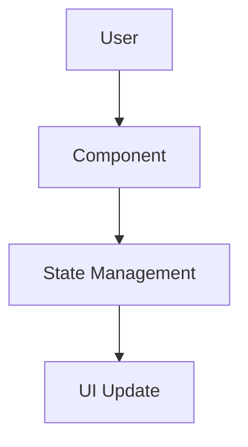
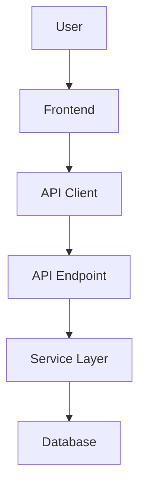
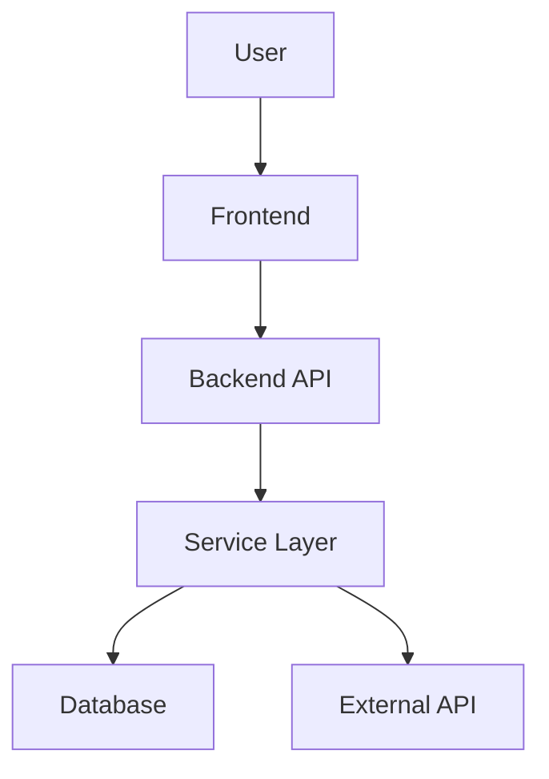

## Visão Geral do Documento

Cada feature produz DOIS arquivos em uma subpasta:

| Arquivo | Propósito | Foco do Conteúdo |
|------|---------|---------------|
| `spec.md` | Especificação técnica | Requirements, architecture, API contracts, data models, error handling, estratégia de testing |
| `plan.md` | Roadmap de implementação | Phases, steps numerados com descrições high-level |

> **Os exemplos deste arquivo são ilustrativos, não prescritivos.** Eles usam SQL/PostgreSQL, Python/SQLAlchemy e pytest apenas para demonstrar o nível de detalhe esperado. Use sempre a stack, os tipos, os idiomas e o framework de testes descobertos no Codebase Pattern Discovery (Step 1.3). Num projeto Mongo, Rails, Go ou .NET, as tabelas mantêm as mesmas colunas conceituais e o conteúdo muda para o equivalente na stack.

---

## Níveis de Complexidade

Esta seção é a **fonte da verdade** para classificação e escalonamento. Classifique a feature no Step 3 antes de gerar os documentos.

| Complexidade | Critérios |
|------------|----------|
| `trivial` | Component único, sem mudanças de API, sem mudanças no DB, sem integrações |
| `simple` | Poucos components, 1-10 endpoints, pequenas mudanças no DB schema, sem integrações |
| `medium` | Múltiplos components, 11-30 endpoints, mudanças regulares no DB schema, integrações básicas |
| `complex` | Múltiplas layers, 30+ endpoints, DB migrations complexas, serviços externos |

**Escalonamento de profundidade por complexidade (documento SPEC):**

| Seção | trivial | simple | medium | complex |
|---------|---------|--------|--------|---------|
| 1. Technical Overview | 2-3 parágrafos | 2-3 parágrafos | 3-4 parágrafos | 4-5 parágrafos |
| 2. Requirements | 1-3 business rules | 3-6 business rules + 1-2 flows | 6-12 business rules + 2-4 flows | 12+ business rules + 4+ flows |
| 3. Architecture | 1-2 components | 2-4 components | 4-8 components | 8+ components |
| 4. Decisions & Assumptions | 1 decisão | 1-2 decisões | 2-4 decisões | 4-6 decisões |
| 5. Component Overview | 2-4 arquivos | 4-6 arquivos | 6-10 arquivos | 10+ arquivos |
| 6. API Contracts | Pular | 1-2 endpoints | 3-5 endpoints | 5+ endpoints |
| 7. Data Model | Pular | Schema básico | Schema completo + indexes | Schema completo + migration |
| 8. Error Handling | 1-2 cenários | 2-4 cenários | 4-8 cenários | 8+ cenários |
| 9. Testing | Tests básicos | Test files + functions | Abrangente | Test matrix completa |

"Pular" vale para `trivial`. Para `simple` e acima, as Seções 6 e 7 são incluídas em forma reduzida — omita apenas se a feature genuinamente não tiver endpoints ou schema, e registre a omissão na Seção 4 (Assumptions).

A Seção 4 (Assumptions) é obrigatória em qualquer complexidade quando houver ao menos uma assumption — e sempre em Batch Mode.

**Escalonamento do documento PLAN:**

| Complexidade | Phases | Steps (total, distribuídos nas phases) | Detalhe da Descrição |
|------------|--------|---------------------------------------|-------------------|
| trivial | 1-2 | 2-4 | High-level (1-2 frases) |
| simple | 2-3 | 5-8 | High-level (1-3 frases) |
| medium | 3-4 | 10-15 | High-level (1-3 frases) |
| complex | 4-5 | 15-25 | High-level (1-3 frases) |

A coluna Steps é o **total do documento**, não por phase. A numeração é contínua entre as phases.

---

## Estrutura do Documento SPEC (9 Seções)

### Seção 1: Technical Overview

**Conteúdo:**
- **What:** Breve descrição do que será implementado
- **Why:** Motivação técnica (não justificativa de negócios)
- **Scope:** dividido em três listas com estes nomes exatos:
  - **Included:** o `Core Scope` do PRD; mais as `Full Scope additions` quando o scope escolhido foi Core + Full; mais as integrações de cross-cutting concerns quando existirem
  - **Deferred:** as `Full Scope additions` quando o scope escolhido foi apenas Core
  - **Excluded:** o que fica explicitamente fora da feature

Os blocos `Consumes` e `Provides` do PRD entram aqui como input/output contracts (e também na Seção 6 quando trafegam via API).

### Seção 2: Requirements

Origem: blocos `Capabilities` e `Experience` do PRD. Traduza requisitos de produto em regras verificáveis — não copie o texto do PRD literalmente.

**Business Rules** (de `Capabilities`):

| ID | Regra | Origem no PRD | Como verificar |
|----|-------|---------------|----------------|
| BR-01 | Regra determinística e testável | Capabilities | Condição observável |

**UX Flows** (de `Experience`):

| Flow | Trigger | Passos | Estado final |
|------|---------|--------|--------------|
| Nome do flow | O que inicia | Sequência resumida | Resultado observável |

Se o PRD não tiver bloco `Experience` (feature sem superfície de usuário), omita a subtabela de UX Flows e registre a omissão na Seção 4.

### Seção 3: Impacto na Architecture

**Conteúdo:**
- Lista de components afetados com os file paths
- Diagrama Mermaid mostrando components e o data flow

**Regra de quoting de labels no Mermaid (obrigatório seguir):**

Envolva qualquer node label em aspas duplas (double quotes) quando contiver caracteres de shape-delimiter ou edge: `/`, `\`, `(`, `)`, `[`, `]`, `{`, `}`, `|`, ou `"`. Caso contrário, o parser do Mermaid os tratará como shape modifiers e quebrará o diagrama.

- Errado: `A[/login page]` — a `/` inicial abre uma forma de trapézio que nunca fecha
- Correto: `A["/login page"]`
- Errado: `B[src/app/page.tsx (RSC)]` — slash mais parênteses dentro do label
- Correto: `B["src/app/page.tsx (RSC)"]`
- Identificadores ASCII simples podem ficar sem quotes: `[SiteHeader]`, `[Hero]`, `[Database]`

Regra geral (Rule of thumb): se um label contiver um path, uma type annotation, um esclarecimento entre parênteses ou qualquer pontuação além de espaços e hífens, aplique o quote.

**Padrões de diagramas (patterns):**

Apenas Frontend:


Fullstack:


Com serviços externos:


### Seção 4: Technical Decisions & Assumptions

**Decisions** — escolhas em que havia uma alternativa real:

| Decisão | Approach Escolhido | Alternativa Considerada | Trade-off |
|----------|----------------|----------------------|-----------|
| [Decisão] | [Escolha] | [Alternativa] | [O que aceitamos] |

**Assumptions** — tudo que foi preenchido sem resposta do PRD nem evidência na codebase:

| # | Assumption | Por quê foi necessária | Origem |
|---|------------|------------------------|--------|
| A-01 | Chunk size de upload = 5 MB | PRD diz "chunked upload" sem definir o tamanho | Auto-Accept: partial PRD spec |
| A-02 | Novo package `xyz` adicionado | Nenhum equivalente na codebase | Auto-Accept: nova tecnologia |

**Obrigatório em Batch Mode:** toda decisão tomada pela Auto-Accept Policy entra nesta tabela, nomeando na coluna Origem a linha da policy que a produziu, para que o usuário possa revisar e fazer override depois. Em single-feature mode, registre aqui as assumptions levantadas no Step 3.

### Seção 5: Component Overview

**Tabelas por layer:**

**Frontend:**

| File Path | Novo/Modificado | Propósito | Key Responsibilities |
|-----------|--------------|---------|---------------------|
| `src/components/Feature.tsx` | Novo | Propósito | 2-3 responsibilities |

**Backend:**

| File Path | Novo/Modificado | Propósito | Key Responsibilities |
|-----------|--------------|---------|---------------------|
| `app/services/feature.py` | Novo | Business logic | 2-3 responsibilities |

**Database:**

| Migration File | Tables Afetadas | Operação | Notas |
|----------------|-----------------|-----------|-------|
| `YYYYMMDD_create_table.sql` | `table_name` | CREATE | Propósito |

Use os layers que a stack do projeto realmente tiver — troque, renomeie ou remova as tabelas acima conforme os patterns descobertos na codebase.

### Seção 6: API Contracts

**Para cada endpoint, inclua:**

- Method, Path, Authentication
- Tabela de Request com: Field, Type, Required, Validation, Description
- Exemplo de JSON Request
- Tabela de Response com: Field, Type, Description
- Exemplo de JSON Response
- Tabela de Error codes com: Code, HTTP Status, Description

Para projetos que não expõem REST, substitua por entry-points equivalentes (GraphQL operations, RPC methods, comandos de CLI, handlers de fila/evento) mantendo as mesmas colunas conceituais.

**Exemplo:**

**Endpoint: Record Token Usage**
- **Method:** POST
- **Path:** `/api/v1/analytics/token-usage`
- **Authentication:** JWT Bearer

**Request:**

| Field | Type | Required | Validation | Description |
|-------|------|----------|------------|-------------|
| `video_id` | `uuid` | Sim | UUID válido | Referência ao vídeo |
| `service` | `string` | Sim | enum: openai, anthropic | AI provider |
| `tokens_input` | `integer` | Sim | min: 0 | Input tokens |

**Exemplo de Request:**
```json
{
  "video_id": "550e8400-e29b-41d4-a716-446655440000",
  "service": "openai",
  "tokens_input": 1500
}
```

**Response (Success - 201):**

| Field | Type | Description |
|-------|------|-------------|
| `status` | `string` | Sempre "success" |
| `data.id` | `uuid` | ID do record criado |
| `data.video_id` | `uuid` | Referência do vídeo |
| `data.tokens_total` | `integer` | Total de tokens computados |
| `data.cost_usd` | `decimal` | Custo calculado |

**Exemplo de Response:**
```json
{
  "status": "success",
  "data": {
    "id": "660e8400-e29b-41d4-a716-446655440001",
    "video_id": "550e8400-e29b-41d4-a716-446655440000",
    "service": "openai",
    "tokens_input": 1500,
    "tokens_total": 1500,
    "cost_usd": 0.0045
  }
}
```

**Error Codes:**

| Code | HTTP Status | Description |
|------|-------------|-------------|
| `TOKEN001` | 400 | Service provider inválido |
| `TOKEN002` | 404 | Vídeo não encontrado |

### Seção 7: Data Model

**Para cada table, inclua:**

**Table: `table_name`**

| Column | Type | Nullable | Default | Description |
|--------|------|----------|---------|-------------|
| `id` | `uuid` | Não | `gen_random_uuid()` | Primary key |
| `field` | `varchar(255)` | Não | - | Descrição |

**Indexes:**

| Index Name | Columns | Type | Propósito |
|------------|---------|------|---------|
| `ix_table_field` | `field` | btree | Query optimization |

**Constraints:**

| Constraint | Type | Definition | Propósito |
|------------|------|------------|---------|
| `pk_table` | PRIMARY KEY | `id` | Identificador único |
| `fk_table_ref` | FOREIGN KEY | `ref_id REFERENCES other(id)` | Integridade referencial |

**Notas Cross-Database (aplicam-se apenas a stacks SQL relacionais):**
- Use `uuid` com GUID helper para compatibilidade PostgreSQL/SQLite
- Use o tipo `decimal(10,4)` em vez de `money`
- Use o pattern `varchar(N)` enum em vez do ENUM nativo para SQLite
- Use `timestamptz` (PostgreSQL) com fallback para `datetime` (SQLite)

Em stacks não relacionais (document store, key-value, event store, grafo), substitua tables/columns/indexes pelos equivalentes — collections e documentos, shape dos keys, índices secundários — mantendo o mesmo nível de detalhe.

**Exemplo de Migration:**
```sql
CREATE TABLE table_name (
    id UUID PRIMARY KEY DEFAULT gen_random_uuid(),
    field VARCHAR(255) NOT NULL,
    created_at TIMESTAMPTZ NOT NULL DEFAULT NOW()
);

CREATE INDEX ix_table_field ON table_name(field);
```

### Seção 8: Error Handling

Origem: bloco `Error Handling` do PRD, ampliado com os edge cases resolvidos na entrevista (ou pelos defaults da Auto-Accept Policy em Batch Mode).

| Cenário | Detecção | Comportamento | Superfície ao usuário | Error code |
|---------|----------|---------------|-----------------------|------------|
| Upload interrompido | Chunk sem ACK após timeout | Retry com backoff, 3 tentativas | Banner "retomando upload" | `TOKEN003` |
| Vídeo inexistente | Lookup retorna vazio | Aborta, sem side effects | 404 com mensagem | `TOKEN002` |

Os valores de `Error code` devem bater com a tabela de Error Codes da Seção 6 sempre que o erro for exposto via API. Erros puramente internos podem ficar sem code — indique com `-`.

### Seção 9: Estratégia de Testing

**Estrutura do Test File:**

| Test File | Test Type | Target | Meta de Coverage |
|-----------|-----------|--------|---------------|
| `tests/unit/test_service.py` | Unit | `service` | 90% |
| `tests/integration/test_api.py` | Integration | API endpoints | 80% |

**Para cada test file, liste as funções:**

| Test Function | Descrição | Assertions |
|---------------|-------------|------------|
| `test_create_success` | Criação válida | Retorna object, DB record existe |
| `test_create_invalid` | Falha de validação | Gera (Raises) ValidationError |

Os acceptance criteria por feature da Seção 9 do PRD viram acceptance tests aqui; os critérios de Cross-Feature Integration que referenciam esta feature viram integration tests.

---

## Estrutura do Documento PLAN

### Header

```markdown
# Implementation Plan: [Nome da Feature]

**Prerequisites:**
- Ferramentas/libraries com versões
- Environment variables
- Arquivos de configuração
```

### Phases e Steps

**Formato:**
```markdown
### Phase N: [Nome do Phase]

**1. Nome do Component** - Descrição high-level do que precisa ser feito. Referencie o spec para detalhes técnicos.

**2. Próximo Component** - Outra descrição high-level...
```

**Numeração:** Contínua em todas as phases (1, 2, 3, 4...)

**Requisitos da descrição do step:**
- 1-3 frases descrevendo O QUE precisa ser feito
- Foco no outcome, não em detalhes de implementação
- Referencie o spec para detalhes técnicos
- O spec contém todos os detalhes técnicos; o plan guia a ordem de execução

**Evite nas descrições de steps:**
- Data types específicos, nomes de columns, method signatures
- Validation rules, constraints, comportamentos de cascade
- Code snippets ou pseudo-code
- Referências a testing

---

## Guidelines de Conteúdo

### Documento SPEC - FAÇA (DO):

1. Inclua file paths completos com responsabilidades
2. Inclua exemplos detalhados de JSON em request/response
3. Inclua field types, validation rules, error codes
4. Inclua schemas completos de table com indexes, constraints
5. Inclua exemplos de SQL migration
6. Inclua nomes de test files e funções específicas
7. Use diagramas Mermaid para architecture
8. Apresente trade-offs para as decisões
9. Registre toda assumption na Seção 4, com a origem
10. Referencie patterns existentes: "Siga o pattern X da feature Y"

### Documento SPEC - NÃO FAÇA (DON'T):

1. Incluir implementação de código real
2. Incluir instruções step-by-step
3. Repetir requisitos de produto do PRD literalmente (traduza em regras verificáveis na Seção 2)
4. Incluir estimativas de tempo
5. Adicionar user stories ou justificativa de negócios
6. Deixar uma decisão sem resposta do PRD implícita, sem entrada na tabela de Assumptions

### Documento PLAN - FAÇA (DO):

1. Use lista numerada em todas as phases
2. Formato: **Número. Nome do Component** - Parágrafo high-level
3. Descreva O QUE precisa ser feito (1-3 frases)
4. Referencie o spec para detalhes técnicos
5. Agrupar em phases

### Documento PLAN - NÃO FAÇA (DON'T):

1. Incluir code snippets ou pseudo-code
2. Incluir detalhes de implementação (data types, columns, methods)
3. Adicionar seções de testing dentro dos steps
4. Mencionar test files ou implementação
5. Repetir decisões de architecture do spec
6. Adicionar estimativas de tempo
7. Usar bullet points dentro dos steps
8. Incluir priority levels

---

## Exemplos

### Step Correto no Plan (High-Level)

```markdown
**1. Token Usage Model e Migration** - Crie o database model e a migration para rastrear o token usage da API por vídeo. Configure os relacionamentos com users e vídeos com os indexes apropriados para query performance.
```

### Step Errado no Plan (Muito Detalhado)

```markdown
**1. Token Usage Model e Migration** - Crie o model SQLAlchemy para a table `token_usage` com fields incluindo `user_id` (uuid, FK para users, ON DELETE CASCADE), `video_id` (uuid, FK para videos), `service` (varchar(50), enum: openai/anthropic/google)...
```

### Step Errado no Plan (Muito Vago)

```markdown
**1. Token Usage Model** - Crie um model para rastrear o token usage com os fields necessários.
```
